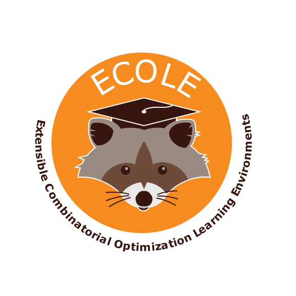

Ecole
=====

.. image:: https://circleci.com/gh/ds4dm/ecole.svg?style=svg
   :target: https://circleci.com/gh/ds4dm/ecole
   :alt: CircleCI

Ecole (pronounced [ekɔl]) stands for *Extensible Combinatorial Optimization Learning
Environments* and aims to expose a number of control problems arising in combinatorial
optimization solvers as Markov
Decision Processes (*i.e.*, Reinforcement Learning environments).
Rather than trying to predict solutions to combinatorial optimization problems directly, the
philosophy behind Ecole is to work
in cooperation with a state-of-the-art Mixed Integer Linear Programming solver
that acts as a controllable algorithm.

The underlying solver used is `SCIP <https://scip.zib.de/>`_, and the user facing API is
meant to mimic the `OpenAi Gym <https://gym.openai.com/>`_ API (as much as possible).

User Documentation
------------------
Please refer to the `documentation <https://doc.ecole.ai>`_ for tutorials, examples, and
installation instructions.

Developer Notes
---------------
.. used to include portion of this file in the documentation
.. SOURCE_INSTALL_START
Build dependencies
^^^^^^^^^^^^^^^^^^
Conda
~~~~~
All dependencies required for building Ecole can be resolved using a
`conda <https://docs.conda.io/en/latest/>`_ environment.
Install everything in a development (named ``ecole``) environment using

.. code-block:: bash

   conda env create -n ecole -f conda-dev.yml

For the following, the ``ecole`` environment always needs to be activated.

.. code-block:: bash

   conda activate ecole
   conda config --append channels conda-forge
   conda config --set channel_priority flexible

*Note: this environment contains tools to build ecole and scip, format code, test,
generate documentation etc. These are more than the dependencies to only use Ecole.*

CMake
~~~~~
`CMake <https://cmake.org/>`_ is a meta-build tool, used for configuring other build tools
(*e.g.* Make) or IDE's.
The whole build of Ecole can be done with CMake.
A one-time configuration is necessary for CMake to find dependencies, detect system
information, *etc*.
Using ``cmake``, we recommend building out of source using ``cmake -B build/`` to
configure, and ``cmake --build build/`` to compile.
CMake is made available in the ``ecole`` environment created earlier.

SCIP runtime dependency
^^^^^^^^^^^^^^^^^^^^^^^
Scip dependency is resolved from `conda` inside `conda-dev.yaml`.
No other action are necessary :)

Building
^^^^^^^^
In the Ecole source repository, configure using

.. code-block:: bash

   cmake -B build/ -D ECOLE_DEVELOPER=ON

*Note: this is the time to pass optional build options, such as the build type and compiler
choice. For instance ``-D CMAKE_BUILD_TYPE=Debug`` can be added to compile with debug
information.*

The definition ``-D ECOLE_DEVELOPER=ON`` changes the default settings (such as the build
type, static analysis, *etc.*) for added convenience and to ensure high quality
contributions.
Only the default settings are changed, this mode does not override any explicit setting.

Then, build Ecole with

.. code-block:: bash

   cmake --build build/

The Python package can finally be installed from the build directory

.. code-block:: bash

   python -m pip install -I build/python

Compiler issues
~~~~~~~~~~~~~~~
If you encounter problem with your compiler (because it is too old for instance),
you can use the ones from ananconda.

.. code-block:: bash

   conda install gxx_linux-64  # Linux

And start again the configuring of Ecole.

.. code-block:: bash

   rm -r build/ && cmake -B build/ -D ECOLE_DEVELOPER=ON

.. SOURCE_INSTALL_END

Running the tests
^^^^^^^^^^^^^^^^^
C++ tests
~~~~~~~~~
The C++ tests are build with `Catch2 <https://github.com/catchorg/Catch2>`_.
It produces a single standalone executable under ``build/libecole/tests/test-libecole``.
For test options, consult

.. code-block:: bash

   build/libecole/tests/test-libecole --help

Python tests
~~~~~~~~~~~~
Python tests are build with `PyTest <https://docs.pytest.org/en/latest/>`_.
As any Python project, running the tests requires that Python finds the correct Ecole
package.
It is therefore **not recommended** to manually install Ecole between every tests, as
it leaves room for running tests with an out of date installation.
The CMake configuration creates a Python virtual environment and installs the Ecole
Python package inside automatically.
To run the tests (or another operation with Python Ecole), use the virtual
environment

.. code-block:: bash

   ./build/venv/bin/python -m pytest python/tests/

Generating the documentation
^^^^^^^^^^^^^^^^^^^^^^^^^^^^
The documentation is a CMake target that is not built by default.
When using ``-D ECOLE DEVELOPER=ON``, the documentation can be generated by providing
the target to the CMake build command:

.. code-block:: bash

   cmake --build build/ --target ecole-sphinx

The generated HTML files are located under ``build/doc/sphinx/html``.
In particular, ``build/doc/sphinx/html/index.html`` can be opened in your browser to
visualize the documentation.

Coding standards
^^^^^^^^^^^^^^^^
The quality and conventions of the code are enforced automatically with various tools, for instance
to format the layout of the code and fix some C++ error-prone patterns.

Compilation database
~~~~~~~~~~~~~~~~~~~~
Some C++ tools need access to a *compilation database*.
This is a file called ``compile_commands.json`` that is created automatically by CMake when using
``-D ECOLE_DEVELOPER=ON``.
The file needs to be accessible at the root directory of the project, so you should symlink it like
so (assuming you set CMake to configure in the directory named ``build`` as shown before).

.. code-block:: bash

   ln -s build/compile_commands.json

Pre-commit
~~~~~~~~~~
The tools are configured to run with `pre-commit <https://pre-commit.com/>`_, that is they can be
added to run automatically when making a commit, pushing, or on demand.
To have the tools run automatically, install the pre-commit hooks using

.. code-block:: bash

   pre-commit install

The tools are configured to run light tests only on the files that were changed during the commit,
so they should not run for long.
Installing the pre-commit hooks to run the tools is recommended.
Similar tests will be run online and pull requests *will* fail if the tools have not been run.

With ``pre-commit`` hooks, commits will be rejected by ``git`` if the tests ran by the tools fail.
If the tools can fix the issue for you, you will find some modifications that you can add to
your commit.

Sometimes when working locally, it can be useful not to run the tools.
You can tell ``git`` to ignore the ``pre-commit`` hooks by passing the ``--no-verify`` to any
``git`` command making commit, including ``commit``, ``merge``, ``rebase``, ``push``...
But again, there is little interest to push commit for which the pre-commit tests fail, as they
will ultimately fail online as well.

Other times you may wish to run the tools on all files unconditionally.
This can be done using

.. code-block:: bash

   pre-commit run --all-files
