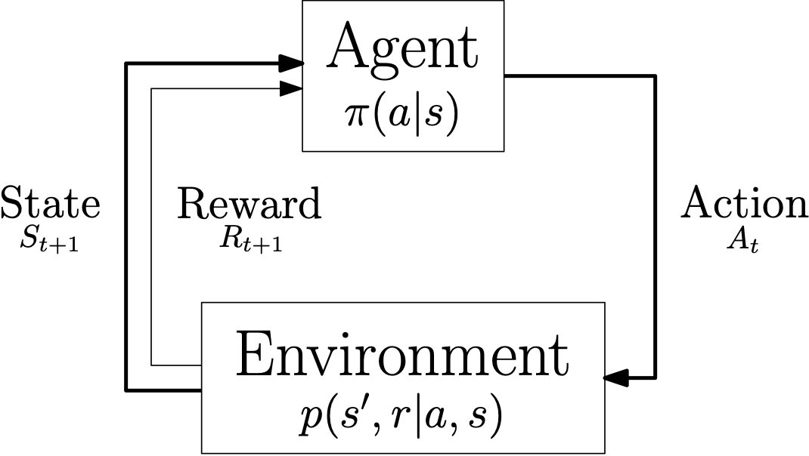

Using Environments
==================

The goal of Ecole is to provide Markov decision process abstractions of common sequential decision making tasks that
appear when solving combinatorial optimization problems using a solver.
These control tasks are represented by stateful classes called environments.

In this formulation, each solving of an instance is an episode.
The environment class must first be instantiated, and then a specific instance must be loaded by a call to
:py:meth:`~ecole.environment.Environment.reset`, which will bring the process to its initial state.
Afterwards, successive calls to :py:meth:`~ecole.environment.Environment.step` will take an action from the
user and transition to the next state.
Finally, when the episode is finished, that is when the instance has been fully solved, a new solving episode can be
started with another call to :py:meth:`~ecole.environment.Environment.reset`.

For instance, using the :py:class:`~ecole.environment.Branching` environment for branch-and-bound variable selection,
solving a specific instance once by always selecting the first fractional variable would look as follows.

.. testcode::

   import ecole

   env = ecole.environment.Branching()
   env.seed(42)

   for _ in range(10):
       observation, action_set, reward_offset, done, info = env.reset("path/to/instance")
       while not done:
           observation, action_set, reward, done, info = env.step(action_set[0])

Let us analyze this example in more detail.

General structure
-----------------
The example is driven by two loops.
The inner ``while`` loop, the so-called *control loop*, transitions from an initial state until a
terminal state is reached, which is signaled with the boolean flag ``done == True``.
In Ecole, the termination of the environment coincides with the termination of the underlying combinatorial
optimization algorithm.
A full execution of this loop is known as an *episode*.
The control loop matches a Markov decision process formulation, as used in control theory, dynamic programming and
reinforcement learning.

   The control loop of a Markov decision process.

.. note::

   More exactly, the control loop in Ecole is that of a `partially-observable Markov decision process
   <https://en.wikipedia.org/wiki/Partially_observable_Markov_decision_process>`_ (PO-MDP), since
   only a subset of the MDP state is extracted from the environment in the form of an *observation*. We omit
   this detail here for simplicity.

The outer ``for`` loop in the example simply repeats the control loop several times, and is in
charge of generating the initial state of each episode.
In order to obtain a sufficient statistical signal for learning the control policy, numerous episodes are usually
required for learning.
Also, although not showcased here, there is usually little practical interest in using the same combinatorial problem
instance for generating each episode.
Indeed, it is usually desirable to learn policies that will generalize to new, unseen instances, which is very unlikely
if the learning policy is tailored to solve a single specific instance.
Ideally, one would like to sample training episodes from a family of similar instances, in order to solve new, similar
instances in the future.
For more details, see the :ref:`Ecole theortical model<theory>` in the discussion.

.. _environment-parameters:

Environment parameters
----------------------
Each environment can be given a set of parameters at construction, in order to further customize the task being
solved.
For instance, the :py:class:`~ecole.environment.Branching` environment takes a ``pseudo_candidates``
boolean parameter, to decide whether branching candidates should include all non fixed integral variables, or only the
fractional ones.
Environments can be instantiated with no constructor arguments, as in the previous example, in which case a set of
default parameters will be used.

Every environment can optionally take a dictionary of
`SCIP parameters <https://scip.zib.de/doc/html/PARAMETERS.php>`_ that will be used to
initialize the solver at every episode.
For instance, to customize the clique inequalities generated, one could set:

.. testcode::

   env = ecole.environment.Branching(
       scip_params={"separating/clique/freq": 0.5, "separating/clique/maxsepacuts": 5}
   )

.. warning::

   Depending on the nature of the environment, some user-given parameters can be overriden
   or ignored (*e.g.*, branching parameters in the :py:class:`~ecole.environment.Branching`
   environment).
   It is the responsibility of the user to understand the environment they are using.

.. note::

   For out-out-the-box strategies on presolving, heuristics, and cutting planes, consider
   using the dedicated
   `SCIP methods <https://scip.zib.de/doc/html/group__ParameterMethods.php>`_
   (``SCIPsetHeuristics`` *etc.*).

:ref:`Observation functions <use-observation-functions>` and
:ref:`reward functions <use-observation-functions>` are more advanced environment
parameters, which we will discuss later on.

.. _resetting-environments:

Resetting environments
----------------------
Each episode in the inner ``while`` starts with a call to
:py:meth:`~ecole.environment.Environment.reset` in order to bring the environment into a new
initial state.
The method is parameterized with a problem instance: the combinatorial optimization problem that will be loaded and
solved by the `SCIP <https://scip.zib.de/>`_ solver during the episode.
In the most simple case this is the path to a problem file.
For problems instances that are generated programatically
(for instance using `PyScipOpt <https://github.com/SCIP-Interfaces/PySCIPOpt>`_ or using
:ref:`instance generators<generate-instances>`) a :py:class:`ecole.scip.Model` is also accepted.

* The ``observation`` consists of information about the state of the solver that should be used to select the next
  action to perform (for example, using a machine learning algorithm.)
* The ``action_set``, when not ``None``, describes the set of candidate actions which are valid for the next transition.
  This is necessary for environments where the action set varies from state to state.
  For instance, in the :py:class:`~ecole.environment.Branching` environment the set of candidate variables
  for branching depends on the value of the current LP solution, which changes at every iteration of the algorithm.
* The ``reward_offset`` is an offset to the reward function that accounts for any computation happening in
  :py:meth:`~ecole.environment.Environment.reset` when generating the initial state.
  For example, if clock time is selected as a reward function in a :py:class:`~ecole.environment.Branching` environment,
  this would account for time spent in the preprocessing phase before any branching is performed.
  This offset is thus important for benchmarking, but has no effect
  on the control problem, and can be ignored when training a machine learning agent.
* The boolean flag ``done`` indicates whether the initial state is also a terminal state.
  This can happen in some environments, such as :py:class:`~ecole.environment.Branching`, where the problem instance
  could be solved though presolving only (never actually getting to branching).

See the reference section for the exact documentation of
:py:meth:`~ecole.environment.Environment.reset`.

Transitioning
-------------
The inner ``while`` loop transitions the environment from one state to the next by giving
an action to :py:meth:`~ecole.environment.Environment.step`.
The nature of ``observation``, ``action_set``, and ``done`` is the same as in the previous
section :ref:`resetting-environments`.
The ``reward`` and ``info`` variables provide additional information about
the current transition.

See the reference section for the exact documentation of
:py:meth:`~ecole.environment.Environment.step`.

Seeding environments
--------------------
Environments can be seeded by using the
:py:meth:`~ecole.environment.Environment.seed` method.
The seed is used by the environment (and in particular the solver) for all the
subsequent episode trajectories.
The solver is given a new seed at the beginning of every new trajectory (call to
:py:meth:`~ecole.environment.Environment.reset`), in a way that preserves
determinism, without re-using the same seed repeatedly.

See the reference section for the exact documentation of
:py:meth:`~ecole.environment.Environment.seed`.
